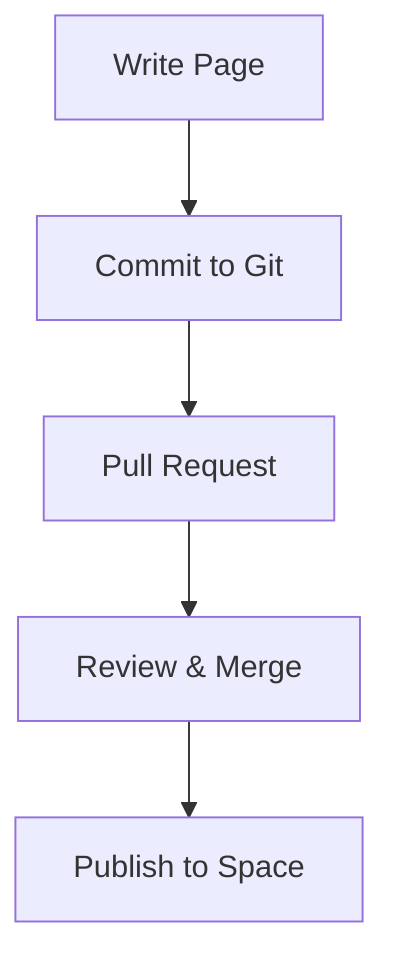

## Overview

best Documentation provides a flexible platform to create, organize, and maintain your project's docs. You structure content using spaces, leverage various content types, collaborate with teams, and manage versions effectively. Master these core concepts to build scalable documentation.

<Columns cols={2}>
  <Card title="Spaces & Organization" icon="folder" href="#spaces">
    Group related docs into spaces for better navigation.
  </Card>
  <Card title="Content Types" icon="file-text" href="#content-types">
    Use MDX, Markdown, and components for rich formatting.
  </Card>
  <Card title="Collaboration" icon="users" href="#collaboration">
    Share, review, and merge changes seamlessly.
  </Card>
  <Card title="Version Control" icon="git-branch" href="#version-control">
    Track changes with Git integration.
  </Card>
</Columns>

## Documentation Spaces and Organization

Organize your documentation into spaces, which act as top-level containers for projects or teams. Create a space for each product or initiative to keep content isolated and searchable.

<Steps>
  <Step title="Create a Space" icon="plus">
    Navigate to the dashboard and select "New Space". Enter a name like "API Docs" and set permissions.
  </Step>
  <Step title="Add Pages" icon="file-plus">
    Within the space, create nested pages using the sidebar. Use folders for hierarchy.
  </Step>
  <Step title="Customize Navigation" icon="menu">
    Drag pages to reorder and generate automatic sidebars.
  </Step>
</Steps>

<Callout kind="tip">
  Use spaces to separate public docs from internal wikis.
</Callout>

## Content Types and Formatting

Support multiple content types including Markdown, MDX with components, and embeds. Format pages using headings, lists, and interactive elements.

<Tabs>
  <Tab title="Markdown Basics" icon="file">
    Start with standard Markdown for quick pages.

    ```markdown
    ## Heading

    - List item
    - Another item

    `Inline code` for variables.
    ```
  </Tab>
  <Tab title="MDX Components" icon="components">
    Enhance with JSX components like `<Callout>`.

    <CodeGroup tabs="JavaScript,Python">
      ```javascript
      import { Callout } from 'best-docs/components';

      <Callout kind="info">
        Tip: Use `YOUR_API_KEY`.
      </Callout>
      ```
      ```python
      # Python example with similar structure
      print("Configure YOUR_API_KEY")
      ```
    </CodeGroup>
  </Tab>
</Tabs>

## Collaboration Features

Invite team members to spaces and assign roles like Editor or Viewer. Use comments, @mentions, and real-time previews to streamline reviews.

| Feature | Description | Use Case |
|---------|-------------|----------|
| Comments | Inline feedback on pages | Review drafts |
| @Mentions | Notify contributors | Assign tasks |
| Pull Requests | Merge changes safely | Team workflows |
| History | View edit logs | Audit trails |

<ExpandableGroup>
  <Expandable title="Advanced Permissions" default-open="false">
    Set granular roles: Admins manage spaces, Editors publish pages, Viewers read-only access.
  </Expandable>
</ExpandableGroup>

## Version Control Basics

Integrate Git for version control. Connect your repo to auto-publish changes or use built-in versioning.



<Callout kind="alert">
  Always test changes in preview mode before publishing.
</Callout>

Track versions manually or via Git:

```bash
git add docs/core-concepts.mdx
git commit -m "Update collaboration section"
git push origin main
```

These concepts form the foundation. Apply them to build professional documentation efficiently.