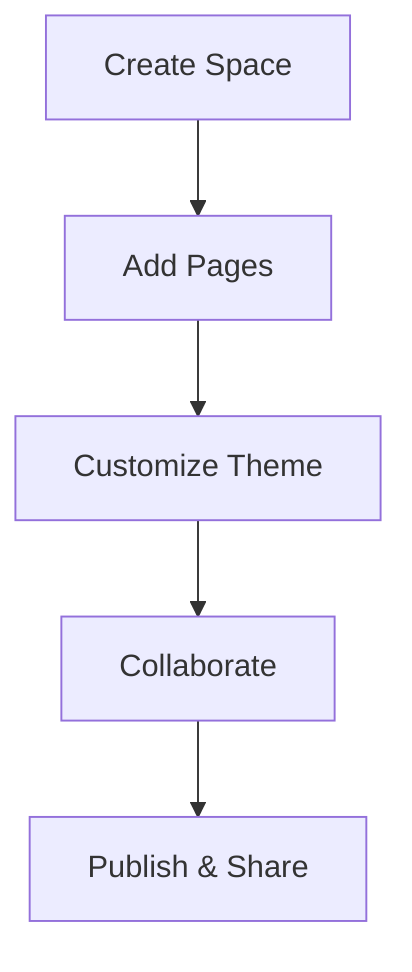

## Overview

best Documentation helps you create, organize, and manage documentation spaces for your projects. You build structured knowledge bases with version control, search, and collaboration features. Customize themes using the brand color `#3B82F6` and integrate with your tools for seamless workflows.

<Callout kind="info">
  Start by creating your first space to organize docs.
</Callout>

## Key Benefits and Features

You gain powerful tools to streamline documentation:

<Columns cols={3}>
  <Card title="Version Control" icon="git-branch" href="/docs/versioning">
    Track changes with Git integration. Roll back edits and collaborate without conflicts.
  </Card>
  <Card title="Search and Navigation" icon="search" href="/docs/search">
    Full-text search across spaces. Use tags and hierarchies for quick access.
  </Card>
  <Card title="Custom Themes" icon="palette" href="/docs/themes">
    Apply your brand color `#3B82F6` and custom layouts.
  </Card>
</Columns>

| Feature | Benefit |
|---------|---------|
| Real-time Collaboration | Multiple users edit simultaneously |
| Embed Components | Add interactive tabs, steps, and code |
| Export Options | PDF, HTML, or Markdown exports |
| Analytics | Track page views and engagement |

## Getting Oriented

Follow these steps to set up your first documentation space:

<Steps>
  <Step title="Create a Space" icon="plus">
    Navigate to the dashboard and click "New Space". Enter a name like "Project Docs".
  </Step>
  <Step title="Add Pages" icon="file-text">
    Create pages using the editor. Use markdown and components for rich content.
  </Step>
  <Step title="Customize Theme" icon="settings">
    Go to Settings > Theme. Set primary color to `#3B82F6`.
  </Step>
  <Step title="Invite Team" icon="users">
    Share the space link or add members via email.
  </Step>
</Steps>

## Platform Integrations

Integrate best Documentation with your stack using simple APIs:

<CodeGroup tabs="JavaScript,Python">
  ```javascript
  const response = await fetch('https://api.bestdocs.com/spaces', {
    headers: {
      Authorization: `Bearer ${YOUR_API_KEY}`
    }
  });
  const spaces = await response.json();
  console.log(spaces);
  ```
  ```python
  import requests
  headers = {'Authorization': f'Bearer {YOUR_API_KEY}'}
  response = requests.get('https://api.bestdocs.com/spaces', headers=headers)
  spaces = response.json()
  print(spaces)
  ```
</CodeGroup>

## Brand Guidelines

<Expandable title="Detailed Brand Guidelines" default-open="false">

Follow these rules to maintain consistency:

- **Primary Color:** `#3B82F6` (use for buttons, links, accents)
- **Typography:** Sans-serif fonts, 16px base size
- **Icons:** Lucide library, stroke width 2
- **Spacing:** 8px grid system

```css
:root {
  --primary: #3B82F6;
  --spacing-unit: 8px;
}
```

Avoid using the color for text backgrounds to ensure readability.

</Expandable>

<Tabs>
  <Tab title="Web" icon="globe">
    Embed docs in your site:
    ```html
    <iframe src="https://docs.best.com/your-space" width="100%" height="600"></iframe>
    ```
  </Tab>
  <Tab title="Mobile" icon="smartphone">
    Use responsive embeds:
    ```html
    <iframe src="https://docs.best.com/your-space?mobile=1" style="width:100%;height:400px;"></iframe>
    ```
  </Tab>
</Tabs>



This setup ensures your documentation stays organized and on-brand. Explore more in the navigation sidebar.