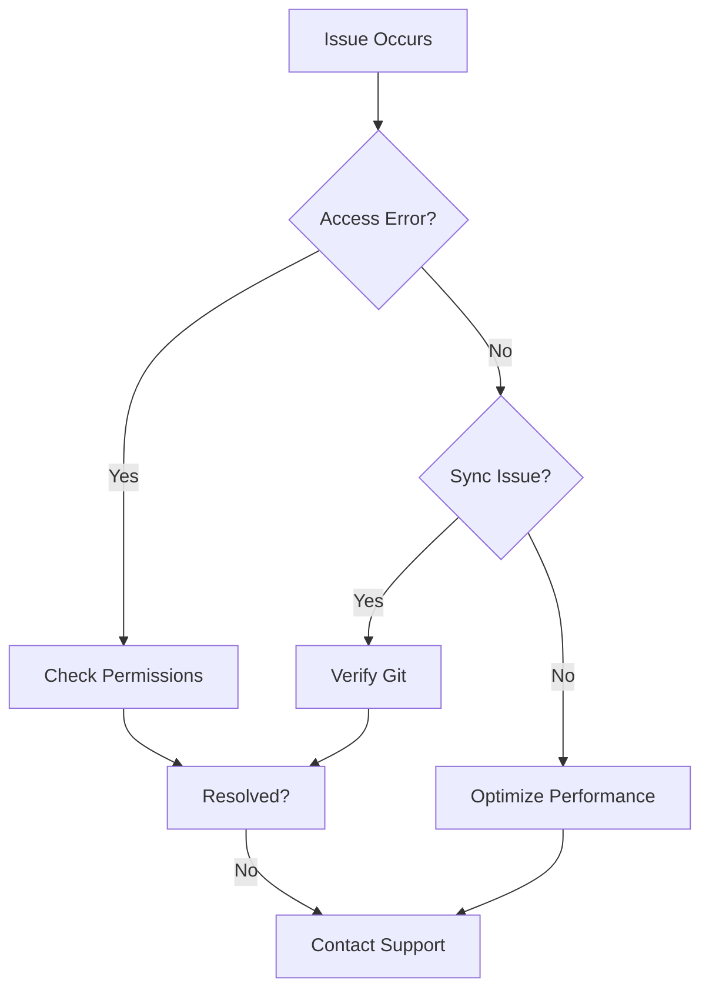

## Access and Permission Errors

Access issues often stem from authentication failures or insufficient project permissions. You encounter these when logging in, editing content, or inviting collaborators.

<Callout kind="tip">
  Verify your account status first. Check if your email is verified and your subscription is active.
</Callout>

Use the following table to identify common error messages and initial fixes:

| Error Message | Likely Cause | Quick Fix |
|---------------|--------------|-----------|
| `401 Unauthorized` | Invalid API token | Regenerate token in settings |
| `403 Forbidden` | Missing edit permissions | Check project roles in admin panel |
| `Permission Denied` | Role restrictions | Request upgrade from project owner |

## Resolving Content Syncing Issues

Content syncing problems occur during Git pushes or pulls between your repository and the documentation site. Follow these steps to diagnose and fix.

<Steps>
  <Step title="Verify Repository Connection" icon="git-branch">
    Navigate to your project settings and confirm the Git repository URL matches your remote origin.

    ```bash
    git remote -v
    ```
  </Step>
  <Step title="Check Branch Configuration" icon="git-pull-request">
    Ensure your default branch (usually `main` or `master`) is selected in the sync settings.
  </Step>
  <Step title="Force Sync" icon="refresh-cw">
    Trigger a manual sync from the dashboard. Monitor the logs for errors.

    <CodeGroup tabs="CLI,Dashboard">
    ````bash
    best-docs sync --project your-project-id --force
    ````
    ```bash
    # Use dashboard button: Sync Now
    ```
    </CodeGroup>
  </Step>
</Steps>

<Callout kind="alert">
  Avoid force pushes (`git push --force`) as they can overwrite changes. Use `git push --force-with-lease` instead.
</Callout>

## Performance Optimization Tips

Slow page loads or editor lag? Optimize your documentation site with these proven strategies.

<Columns cols={3}>
  <Card title="Enable Caching" icon="hard-drive" href="/docs/caching">
    Configure CDN caching headers for static assets to reduce load times by up to 70%.
  </Card>
  <Card title="Optimize Images" icon="image" href="/docs/images">
    Compress images and use modern formats like WebP. Aim for `<100KB` per image.
  </Card>
  <Card title="Minify Assets" icon="code" href="/docs/build">
    Run production builds to minify JS/CSS. Check bundle sizes in the build logs.
  </Card>
</Columns>

For advanced tuning, review your site's Lighthouse score.

<Tabs>
  <Tab title="JavaScript Bundle Check" icon="code">
    Analyze your build output:

    ````javascript
    // webpack.config.js example
    module.exports = {
      optimization: {
        minimize: true,
        splitChunks: {
          chunks: 'all',
        },
      },
    };
    ````
  </Tab>
  <Tab title="Server Config" icon="server">
    Update your hosting provider settings for compression.

    ````nginx
    # nginx.conf
    gzip on;
    gzip_types text/plain application/javascript image/svg+xml;
    ````
  </Tab>
</Tabs>

## Contacting Support

When self-troubleshooting fails, reach out to support efficiently.

<ExpandableGroup>
  <Expandable title="Gather Diagnostic Info" default-open="true">
    Collect these details before submitting a ticket:

    1. Project ID and URL
    2. Browser console errors (F12 > Console)
    3. Recent changes made
    4. Screenshots of the issue

    ```bash
    # Generate diagnostic report
    best-docs diagnostics --project your-project-id > diagnostics.json
    ```
  </Expandable>
  <Expandable title="Submit Ticket">
    Visit the support portal at https://best-docs.com/support. Use the pre-filled form with your diagnostics.
  </Expandable>
</ExpandableGroup>

## Troubleshooting Flow



Most issues resolve within these steps. If problems persist, support responds within 24 hours.